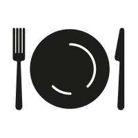

MealApp, which is my project that created individually to fulfill the Front-End learning path submission on the Dicoding platform. Where this project has a food theme in displaying a list of foods based on keywords, categories, ingredients, etc. using AJAX to utilize the available public API. Due to submission provisions, this project was built without using any framework, this project uses JavaScript with NPM and other packages, CSS (MaterializeCSS), ESLint to maintain consistent code writing style, and bundling with Webpack for the production and development stages.
